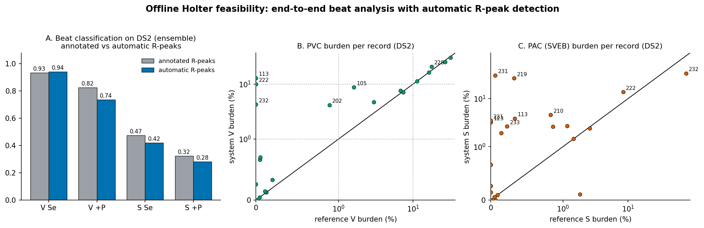
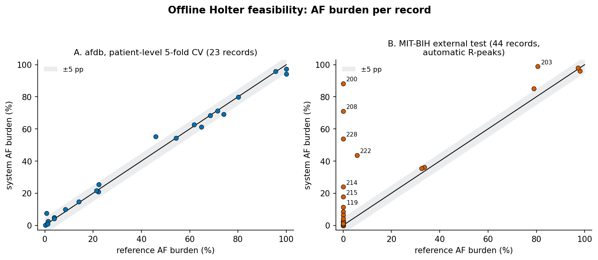
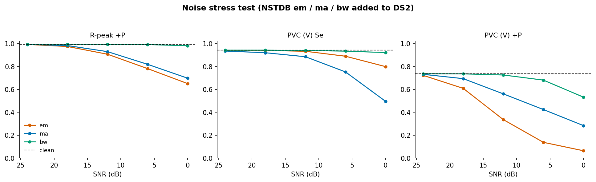
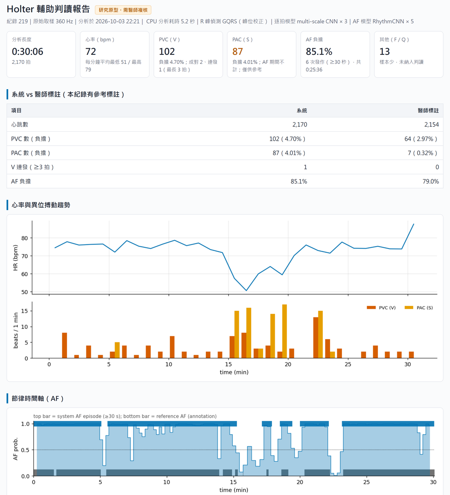

# AI用於離線 Holter 輔助判讀的可行性研究


> 單導程原始 ECG → 自動 R 峰偵測 → 逐拍分類（N / S / V）＋ AF 偵測 → Holter 摘要報告。

## 結論

在 MIT-BIH 的**未見過的病人**（inter-patient）上：

- **R 峰偵測、AF 偵測與 AF 負擔：可行。**
- **PVC 計數：有條件可行。** 漏得很少（Se 94%），但約四分之一的 PVC 標記是誤標，需要醫師刪除。
- **PAC 計數：不可行。** Se 42%、+P 28%，只能當提示。
- **處理速度：可行。** 24 小時紀錄在一般 CPU 上 3.6 分鐘跑完（不用 GPU）。
- **雜訊：有條件可行。** 基線漂移幾乎沒有影響；電極移動與肌電在 SNR 18 dB 仍可用，到 12 dB 會冒出大量假 PVC。

實務上最大的兩個風險：**頻繁早期收縮（二聯律、成串 PVC）會被誤判成 AF**，以及**誤偵測的假心跳會變成假 PVC**。

### 可行性判定（F1–F9）

| # | 項目 | 可行門檻 | 有條件可行門檻 | 結果 | 判定 |
|---|---|---|---|---|---|
| F1 | R 峰偵測（DS2 22 筆） | Se、+P 皆 ≥ 99% | 皆 ≥ 97% | Se 99.92%、+P 99.28% | 可行 |
| F2 | PVC（V）逐拍，端到端 | Se ≥ 90% 且 +P ≥ 80% | Se ≥ 80% 且 +P ≥ 60% | Se 94.2%、+P 73.5% | 有條件可行 |
| F3 | PAC（S）逐拍，端到端 | Se ≥ 80% 且 +P ≥ 60% | Se ≥ 60% 且 +P ≥ 40% | Se 41.9%、+P 28.2% | 不可行 |
| F4 | 每筆 PVC 負擔（DS2） | 中位數絕對誤差 ≤ 1 個百分點，且分級一致 ≥ 90% 的紀錄 | ≤ 3 個百分點，且一致 ≥ 75% | 0.63 個百分點；分級一致 18／22 筆（82%） | 有條件可行 |
| F5 | AF 窗層級（afdb 23 筆，病人層級 5-fold） | Se、Sp 皆 ≥ 95% | 皆 ≥ 90% | Se 97.3%、Sp 97.2% | 可行 |
| F6 | AF 外部測試（MIT-BIH 44 筆，自動 R 峰） | Se、Sp 皆 ≥ 90% | 皆 ≥ 80% | Se 95.7%、Sp 88.4% | 有條件可行 |
| F7 | 每筆 AF 負擔 | 中位數絕對誤差 ≤ 5 個百分點 | ≤ 10 個百分點 | afdb 0.8；MIT-BIH 含 AF 紀錄 3.1 個百分點 | 可行 |
| F8 | 處理速度（CPU，24 小時紀錄） | ≤ 10 分鐘 | ≤ 60 分鐘 | 3.6 分鐘（i5-12600KF、不用 GPU；115,635 拍） | 可行 |
| F9 | 雜訊（NSTDB 電極移動、肌電） | SNR 12 dB 時 F1、F2 仍達有條件可行 | SNR 18 dB 時達到 | 18 dB：R 峰 +P 97.4%／98.2%、PVC +P 60.8%／69.3%；12 dB：PVC +P 降到 33.6%／56.0% | 有條件可行 |

- **門檻在 2026-09-15、跑任何新實驗之前就訂好**，看到結果後沒有調整。
- **三級判定**：達到「可行門檻」為可行；只達到「有條件可行門檻」代表需人工複核才能使用；兩者都未達為不可行。
- 判定用的是部署版本（逐拍模型為 3 個 seed 的 ensemble）。
- PVC 負擔分級採本研究定義的三級：< 1%、1–10%、≥ 10%。
- F7 的 MIT-BIH 部分只計含 AF 的 7 筆紀錄，並取兩個資料集中較差者：37 筆無 AF 紀錄的誤差多為 0，全部納入會把中位數壓低、掩蓋問題；無 AF 紀錄上的假 AF 由 F6 的 Sp 反映。這是跑完 AF 評估後補充的算法說明，門檻未改，且比原本的寫法更嚴格。

### 換成 Holter 報告上的每一項

| 報告項目 | 能不能用 | 依據 |
|---|---|---|
| 心跳數、心率 | 可以 | F1：每 1,000 拍漏不到 1 拍、多出約 7 拍 |
| PVC 數與負擔 | 輔助使用，需複核 | F2、F4：PVC 幾乎不漏，但誤標多；雜訊段會冒出假 PVC |
| PAC 數 | 只當提示 | F3：一半以上的 PAC 抓不到，標出來的七成是錯的 |
| AF 有無、發作、負擔 | 輔助使用，需複核 | F5–F7：AF 幾乎都抓得到；但頻繁早期收縮的病人會出現假 AF |

### 判準怎麼訂的

**使用情境。** 24 小時單導程 Holter 紀錄回收後，由電腦批次分析，產出預先標註與摘要報告，再由醫師複核。
不需即時判讀，所以 RR 特徵可以使用前後文（包含下一拍與前後各 10 拍的平均）。

**系統是「輔助」。** 漏標的代價（漏診）高於多標（醫師多刪幾個標記），所以逐拍判準以 Se 為主、+P 為輔。
輸出類別為 N、S（PAC）、V（PVC）。F、Q 在測試集只有 388 與 7 拍，且幾乎全錯，報告中併入「其他」，不列入判準；這個合併不影響 S、V 的指標。

**各項門檻的理由：**

- **F1**：後面每一步都建立在 R 峰上，漏掉的拍直接變成漏判。經典 QRS 偵測器在 MIT-BIH 上約在 99% 以上；低於 97% 表示連帶的逐拍統計已不可信。
- **F2**：PVC 是 Holter 最主要的計數項目。+P 80% 代表醫師每複核 5 個 PVC 標記，至多刪 1 個。
- **F3**：病人不重疊時，PAC 和正常拍的形態幾乎一樣，公認難分，所以門檻比 PVC 寬；未達代表 PAC 只能當「提示」，不能當計數。
- **F4**：臨床看的是整筆紀錄的 PVC 量，而不是單拍對錯；逐拍錯誤在計數上可能互相抵銷，也可能累積，要直接量。
- **F5–F7**：AF 在 Holter 報告中以「有沒有、多久、佔多少時間」呈現，所以同時看窗層級與負擔誤差；外部測試的門檻略低於交叉驗證，反映資料來源不同。
- **F8**：10 分鐘內可以在收件後立即出報告；60 分鐘內仍可接受整夜批次處理。
- **F9**：Holter 是活動中的長時間紀錄，電極移動與肌電雜訊是常態。

---

## 系統

```
單導程 ECG（任何取樣率 → 重取樣到 360 Hz）
   │
   ├─ 自動 R 峰偵測：GQRS ＋ 峰位校正          src/preprocess/qrs.py
   │
   ├─ 每拍：256 點單拍窗 ＋ 4 維 RR 特徵 ──► multi-scale CNN × 3（seed ensemble）──► N / S / V（F / Q 列為其他）
   │
   ├─ 每 32 拍 RR 窗（步長 16）──────────► RhythmCNN × 5（fold ensemble）──► AF 機率 ──► AF 段（≥ 30 秒）
   │
   └─ Holter 摘要：心率、PVC／PAC 數與負擔、成對與連發、AF 發作與負擔     src/holter.py
                                                                      holter_report.py（HTML 報告）
```

- **兩個模型都很小。** 逐拍模型是單拍形態 ＋ RR 特徵的 multi-scale CNN（14,917 個參數），由 `train_beat.py` 訓練 3 個 seed；
  AF 模型是 RhythmCNN（9,250 個參數），由 `eval_af.py` 以病人層級 5-fold 訓練。
  開發過程中也試過自監督預訓練，沒有穩健的幫助（見下方「開發過程」），所以部署版本不含預訓練。
- **評估的就是部署的。** 權重與前處理參數打包成 `models/holter_beat.pt`、`models/holter_af.pt`，
  評估腳本與報告讀同一份。
- **管線正確性有驗證。** 用醫師標註的 R 峰跑部署管線，三個 seed 的測試數字與訓練時的報表（`runs/20260708_221912_train_beat/`）
  一致到小數第 4 位（例：seed 42 的 S-F1 0.4245、V-F1 0.8465），確認前處理和訓練期相同。

## 驗證設計

| 用途 | 資料 | 說明 |
|---|---|---|
| 選 R 峰偵測器 | MIT-BIH DS1（22 筆） | 只用訓練病人挑，不看測試集 |
| 逐拍端到端測試 | MIT-BIH DS2（22 筆） | 模型從未見過這些病人；設定固定後只跑一次 |
| AF 模型 | afdb（23 筆） | 病人層級 5-fold，每位病人恰好被測一次 |
| AF 外部測試 | MIT-BIH 44 筆非起搏紀錄 | AF 模型從未見過 MIT-BIH；7 筆含 AF |
| 雜訊測試 | DS2 ＋ NSTDB 標準雜訊 | 電極移動 em、肌電 ma、基線漂移 bw |

逐拍模型不重新訓練，也不用 DS2 挑選偵測器、門檻或任何參數。評估定義：

- **R 峰比對**：ANSI/AAMI EC57 慣例，±150 ms 一對一比對；參考為 `.atr` 中屬於 AAMI 五類的心跳。
- **逐拍 Se**（類別 c）＝ 被偵測到且判為 c 的真 c 拍 ÷ 全部真 c 拍，**漏偵測的拍算漏判**。
- **逐拍 +P**（類別 c）＝ 判為 c 且真為 c ÷ 所有被判為 c 的偵測拍，**誤偵測的假拍若被判成 c，也算進分母**。
- **每筆負擔**：V（或 S）拍數 ÷ 總拍數；系統端用自動偵測的拍，參考端用標註的拍。
- **AF**：32 拍的 RR 窗中 AF 比例 ≥ 0.5 標為 AF；每筆 AF 負擔 ＝ 判為 AF 的 RR 時間 ÷ 總 RR 時間；報告中的 AF 發作定義為連續 ≥ 30 秒。
- **處理速度**：一般 PC 的 CPU（不用 GPU），從讀檔到產出摘要的總時間。

---

## 結果

### 1. R 峰偵測（F1）

DS1 上比較四種設定，依事先訂好的規則，先以 F 值選方法、再以與標註位置的偏移決定是否校正峰位：

| 設定 | Se | +P | 與標註位置的中位數偏移 |
|---|---|---|---|
| **GQRS ＋ 峰位校正（選定）** | **99.82%** | **99.22%** | **5.6 ms** |
| GQRS | 99.82% | 99.23% | 33.3 ms |
| XQRS ＋ 峰位校正 | 98.64% | 98.86% | 19.4 ms |
| XQRS | 98.67% | 98.65% | 0.0 ms |

峰位校正不影響偵測率，但把位置拉回模型訓練時的中心點（33 ms → 5.6 ms）。
DS2：49,712 拍中漏 38 拍、多出 361 個假拍（**Se 99.92%、+P 99.28%**）。假拍集中在 113（+P 91.4%）與雜訊多的 105（+P 97.0%）。

### 2. 逐拍分類：醫師標註的 R 峰 vs 自動 R 峰（F2、F3）

| DS2（22 筆） | V Se | V +P | V F1 | S Se | S +P | S F1 |
|---|---|---|---|---|---|---|
| 標註 R 峰，3-seed 平均 | 0.909±0.053 | 0.818±0.082 | 0.855±0.018 | 0.470±0.092 | 0.309±0.058 | 0.366±0.046 |
| 標註 R 峰，ensemble | 0.934 | 0.825 | 0.876 | 0.475 | 0.323 | 0.384 |
| **自動 R 峰，ensemble（部署）** | **0.942** | **0.735** | **0.826** | **0.419** | **0.282** | **0.337** |
| 自動 R 峰，3-seed 平均 | 0.917±0.054 | 0.729±0.081 | 0.806±0.026 | 0.409±0.102 | 0.268±0.037 | 0.315±0.019 |



- **換成自動 R 峰，PVC 仍幾乎不漏**（Se 93.4% → 94.2%；DS2 3,220 個 PVC 只漏偵測 6 個），
  **但誤標變多**（+P 82.5% → 73.5%）。1,093 個誤標的 PVC 中，**293 個（27%）根本不是心跳**，是偵測器多抓的假拍
  （集中在 113 與 105）；其餘 523 個是正常拍、239 個是 PAC。
- **PAC 在兩種條件下都不可用。** S 的形態和正常拍幾乎一樣，主要靠 RR 判斷；DS2 的 1,837 個 PAC 有 75% 來自同一筆（232），
  單一病人的特性就能左右結果。
- ensemble 在 V 上比單一 seed 穩定（3 個 seed 的 V +P 從 0.66 到 0.84 不等）。

### 3. 每筆紀錄的 PVC／PAC 負擔（F4）

- **PVC：22 筆中 18 筆分級一致（<1%、1–10%、≥10%），中位數絕對誤差 0.63 個百分點。**
  不一致的 4 筆：113（0% → 12.9%，假拍被判成 PVC）、222（0% → 10.0%，心房撲動與交界性節律）、232（0% → 4.3%）、202（0.9% → 4.2%）。
- **PAC：負擔誤差很大。** 例如 219 在 AF 期間被算出 26.7% 的 PAC（實際 0.3%）、231（2:1 房室傳導阻滯）30.6%（實際 0.1%）。

### 4. AF 偵測（F5–F7）

| 資料 | Se | Sp | PPV | F1 |
|---|---|---|---|---|
| afdb 病人層級 5-fold（pooled，23 筆） | 97.3% | 97.2% | 96.6% | 0.970 |
| 各 fold 平均 ± 標準差 | 97.3±1.9% | 97.7±1.7% | — | 0.960±0.035 |
| **MIT-BIH 外部（44 筆，自動 R 峰）** | **95.7%** | **88.4%** | **50.7%** | **0.663** |
| MIT-BIH 外部（44 筆，標註 R 峰） | 96.8% | 88.8% | 51.9% | 0.676 |



- **afdb 上 AF 負擔幾乎完全對得上**（中位數誤差 0.8 個百分點，最大 9.2）。最初的 AF 實驗只測 4 位病人，現在 23 位病人都被測過一次，結論不再依賴特定病人。
- **外部測試抓得到 AF，但會把頻繁早期收縮當成 AF。** 37 筆沒有 AF 的紀錄中，8 筆被判出 > 5% 的 AF 負擔，
  最嚴重的是 200（88%）、208（71%）、228（54%），全是 PVC／PAC 很多的紀錄
  （假 AF 負擔與異位搏動負擔的 Spearman ρ = 0.57，p = 0.0002，見第 7 節）。
  AF 模型只看 RR 間期，而頻繁早期收縮讓 RR 同樣不規則。
- **PPV 只有 51%**：MIT-BIH 裡 AF 少（44 筆中 7 筆），假警報的比例就被放大。這正是 Holter 族群的實際情況，AF 標記必須由醫師確認。
- R 峰來源（自動 vs 標註）對 AF 幾乎沒有影響。222 含心房撲動等不規則節律（參考標註只把 AFIB 算 AF），
  系統判出 44% 的 AF 負擔（參考 6%），是另一種已知的混淆。

### 5. 處理速度（F8）

MIT-BIH 48 筆紀錄串接成一筆 24.07 小時的紀錄，在一般 PC 的 CPU（Intel i5-12600KF，不用 GPU）上跑完整部署管線，實測、不外推：

| 步驟 | 耗時 |
|---|---|
| R 峰偵測 | 193.3 秒 |
| 逐拍分類（115,635 拍 × 3 個模型） | 18.3 秒 |
| AF（5 個模型） | 0.4 秒 |
| 讀檔與摘要 | 1.9 秒 |
| **合計** | **213.8 秒 ≈ 3.6 分鐘** |

九成時間花在 R 峰偵測（wfdb 的 GQRS 是純 Python 實作），兩個 CNN 合計不到 20 秒。
要再快，換成編譯過的偵測器即可；模型本身不是瓶頸。

### 6. 雜訊（F9）

DS2 22 筆全程疊加 NSTDB 標準雜訊（SNR 依 WFDB `nst` 的定義），每個條件都跑完整部署管線：

| 雜訊 | SNR | R 峰 Se | R 峰 +P | PVC Se | PVC +P |
|---|---|---|---|---|---|
| 無 | — | 99.9% | 99.3% | 94.2% | 73.5% |
| 電極移動（em） | 18 dB | 99.9% | 97.4% | 93.9% | 60.8% |
| 電極移動（em） | 12 dB | 99.9% | 90.6% | 93.2% | 33.6% |
| 肌電（ma） | 18 dB | 99.9% | 98.2% | 91.9% | 69.3% |
| 肌電（ma） | 12 dB | 99.7% | 92.9% | 88.5% | 56.0% |
| 基線漂移（bw） | 12 dB | 99.9% | 99.2% | 93.9% | 72.5% |
| 基線漂移（bw） | 0 dB | 99.9% | 98.0% | 92.1% | 53.2% |



- **雜訊幾乎不會讓心跳漏掉，而是多出假心跳。** R 峰 Se 到 6 dB 仍在 98.8% 以上；多出來的假心跳大多被判成 PVC，
  所以最先崩的是 PVC 的 +P（電極移動 12 dB 時只剩 34%）。
- **基線漂移影響很小，電極移動最嚴重。**
- 實務意義：雜訊段的 PVC 數不可信。上線前需要在計數之前加一道**訊號品質檢查，把雜訊段排除或標記**（列為後續工作）。

### 7. 事後探索分析（看過結果才做，不改變上面的判定）

- **AF 期間不計 PAC。** AF 時心房沒有規律的電活動，PAC 無從定義。加上這條規則後，DS2 的 PAC +P 從 28.2% 升到 42.6%，
  每筆 PAC 負擔的中位數誤差從 1.73 降到 0.63 個百分點（219：579 → 87 個，參考 7 個），但 Se 從 41.9% 降到 38.0%，F3 仍然不可行。
  部署版本與報告已採用這條規則（報告上有註明），可行性判定仍以訂定判準時的原始系統為準。
- **假 AF 來自頻繁早期收縮。** 見第 4 節。可能的改良是先用逐拍分類剔除早期收縮前後的 RR，再判 AF；這需要在新資料上驗證，列為後續工作。

---

## 應用展示：Holter 輔助判讀報告

```bash
python holter_report.py --record 219                 # MIT-BIH 本機紀錄（有參考標註時，附「系統 vs 醫師標註」對照）
python holter_report.py --wfdb path/to/record        # 任何 WFDB 紀錄
python holter_report.py --csv ecg.csv --fs 250       # 單欄 CSV（mV），任何取樣率
```

輸出 `reports/<紀錄>_holter_report.html`（單一檔案、離線可開、可列印）與 `reports/<紀錄>_summary.json`。報告內容：

- 摘要：分析長度、心率（平均與每分鐘最低／最高）、PVC 數與負擔、成對與連發、PAC 數（標註「僅供參考」）、AF 負擔與發作次數
- 若有參考標註：系統與醫師標註並列
- 心率與 PVC／PAC 趨勢圖、AF 機率時間軸（系統 AF 段與參考 AF 段並列）、AF 發作列表
- 10 秒心電圖片段（最長 V 連發、PAC、AF 起點），每拍標上系統判讀（有參考時一併標出醫師標註與漏偵測的拍）
- 使用限制（研究原型、需醫師複核、PAC 不可用、假 AF 風險）

`reports/` 內附三份範例（皆為模型沒看過的 DS2 病人；GitHub 上會顯示 HTML 原始碼，請下載後用瀏覽器開啟）：

| 紀錄 | 看點 |
|---|---|
| [219](reports/219_holter_report.html) | AF 與 PVC 並存；AF 負擔系統 85% vs 參考 79% |
| [233](reports/233_holter_report.html) | 頻繁 PVC（參考 27%），無 AF |
| [200](reports/200_holter_report.html) | **限制示範**：頻繁早期收縮被誤判成 AF |

紀錄 219 的報告（上半部）：



---

## 開發過程：模型怎麼來的

| 階段 | 做了什麼 | 在本系統中的角色 |
|---|---|---|
| 誠實 baseline | 改成病人不重疊的切分（DS1／DS2）：原本約 98% 的 accuracy，是同一位病人的心跳同時出現在訓練與測試造成的假象 | 所有評估的基礎 |
| 加入 RR 節律 | 單拍形態 ＋ RR 特徵的 multi-scale CNN，PAC 的 F1 從 0.039 升到 0.366（3 個 seed） | **部署的逐拍模型**（`train_beat.py`） |
| AF 偵測 | 用 RR 窗判斷 AF（afdb） | **部署的 AF 模型**（改為病人層級 5-fold 交叉驗證重新訓練） |
| 聯合訓練 | 心跳分類與 AF 共享 encoder：對心跳分類沒有穩健的幫助 | 未採用 |
| 自監督預訓練 | 自監督表示學習（正對定義、預訓練方式、低標籤）：沒有穩健的幫助，決定表示品質的是 RR 節律資訊 | 未採用；結論是不需要預訓練 |

## 限制

1. **資料都來自同一家族。** MIT-BIH 與 afdb 同一機構、同年代、雙導程；MIT-BIH 上的 AF 測試只能算「跨資料庫」，不是跨機構的外部驗證。
2. **紀錄長度。** MIT-BIH 每筆 30 分鐘；24 小時 Holter 的長時間變化（睡眠、活動）沒有涵蓋，速度測試用 48 筆串接模擬。
3. **測試病人少且集中。** DS2 22 人、afdb 23 人；例如 DS2 的 PAC 有 75% 來自同一筆紀錄。
4. **模型以醫師標註的 R 峰訓練。** 沒有針對自動偵測的位置誤差重新訓練（刻意不動，讓評估不受 DS2 影響）。
5. **F、Q 類與起搏紀錄不在範圍內**；「AF 期間不計 PAC」與假 AF 分析是事後分析。
6. **可行性門檻是本研究自訂**，不是法規或臨床標準；本研究不是臨床驗證，系統不是醫療器材。

## 重現

```bash
pip install -r requirements.txt
python smoke_test.py         # 數秒，免資料：5 條管線（含 Holter 部署管線）
python train_beat.py         # （可選）重新訓練逐拍模型 3 個 seed；本文結果用的是 runs/20260708_221912_train_beat/
python eval_end2end.py       # F1–F4：選偵測器（DS1）、打包 models/holter_beat.pt、DS2 端到端
python eval_af.py            # F5–F7：afdb 5-fold、打包 models/holter_af.pt、MIT-BIH 外部測試
python benchmark_speed.py    # F8：48 筆串接成 24 小時，CPU 實測
python eval_noise.py         # F9：首次會下載 NSTDB 的 em／ma／bw（約 6 MB）
python eval_posthoc.py       # 事後探索分析
python holter_report.py --record 219
```

每個腳本輸出到 `runs/<時間戳>_<腳本名>/`（表格 `.txt`、完整數字 `.json`、圖 `.png/.pdf`，以及設定快照）。
重新訓練逐拍模型後，用 `python eval_end2end.py --src-run runs/<新的資料夾>` 打包新的權重。
mitdb 首次執行會自動下載；afdb 的 RR 窗首次從 PhysioNet 串流後快取在 `cache/`。

## 專案結構

```
README.md                 本檔
config.yaml               所有超參數
requirements.txt

src/holter.py             部署管線：逐拍分類、AF、PAC 規則、Holter 摘要、analyze_record
src/preprocess/           自動 R 峰偵測（qrs.py）、RR 特徵與節律標註、濾波、wfdb 讀取、AAMI 類別對照
src/dataset/              MIT-BIH 單拍與 afdb RR 窗的載入、快取、PyTorch Dataset
src/model.py              MultiScaleECGNet（逐拍）、RhythmCNN（AF）等
src/splits/  src/metrics.py  src/engine.py  src/utils/   病人層級切分、評估指標、訓練迴圈、可重現性

train_beat.py             訓練逐拍模型（含只看形態的對照組）
eval_end2end.py  eval_af.py  benchmark_speed.py  eval_noise.py  eval_posthoc.py   評估（F1–F9 與事後分析）
holter_report.py          應用展示：輸入一筆 ECG，產出 HTML 報告
smoke_test.py             免資料的快速測試

models/                   部署 bundle（holter_beat.pt、holter_af.pt）
reports/                  範例 Holter 報告
docs/figures/             README 用圖
runs/                     逐拍模型訓練與各項評估的輸出（含設定快照）
```
